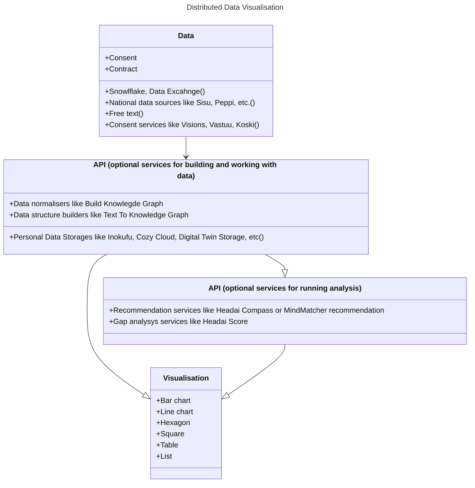
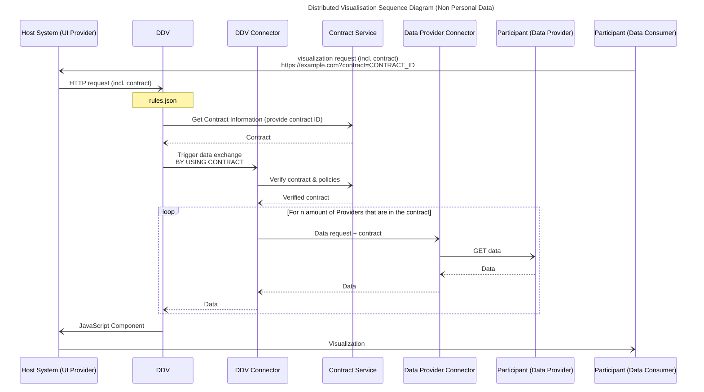
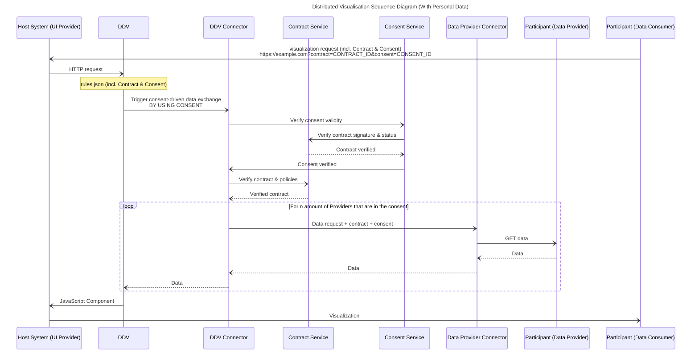

# Distributed data visualization BB – Design Document

Distributed Data Visualisation is an on-device building block to ease up building end-user UIs for showing data in an informative way. It allows AI providers to display the results of their analytics, predictions and recommendations.

The building block is a reusable, portable and multi-platform supported HTML5 / JavaSript & D3.js based component that can be displayed by UI provider from any source.

This concept is not only about presenting data in an accessible format, but also about revolutionizing the way data interacts across different platforms, ensuring data privacy and improving user control. With the Prometheus-X project at the forefront, a ground-breaking approach to handling education and career development data will redefine industry standards.

Distributed data visualization is a sophisticated framework designed to seamlessly manage and display data across multiple platforms. It enables AI providers to process datasets from different data providers and gain valuable insights such as recommendations, analysis and predictions. What makes this approach special is the ability to easily integrate these results into different applications and user interfaces (UI), making it a versatile tool for educational and professional development.

## Technical usage scenarios & Features

Distributed data visualisation builds the story /user journey for the given goal and given data sets, it applies other building blocks to modify/anonymize/analyse the data. It enables to run analysis by applying other building blocks and Data Space Services from Catalog (under contract).

### Features/main functionalities

**User journey case 1:**

Use case description, value and goal: The use case will take as basis Pino a product from Solideos used by Korean citizens to store their diploma and learning credentials. Use information from Korean users' Diploma and Transcript to match job opportunities in the EU (France). Skills data extracted from the documents will be used for service providers in the EU to recommend potential employment opportunities.

Use case functionalities:

- A professional can share her/his skills data and visulise it
- A Job Matching service can visualize the match between job to be filled and candidate's skills
- A company can quickly visualise the match and gap between diploma and their skills demand.

**User journey case 2:**

Use case description, value and goal: LAB aims to prepare individuals for the job market by offering personalized training recommendations worldwide, leveraging skills data and partnerships with service providers like Headai, Inokufu, Rejustify, and Edunao. The goal is to equip learners with relevant skills for career success, enhancing employability and lifelong learning.

Use case functionalities:

- Personalized training recommendations based on skills data analysis.
- Access to high-quality training opportunities worldwide.
- Skills forecasting and analytics for anticipating future skill demands.
- Skills assessment and analysis to determine individual skills and areas for improvement.

**Generic user journey:**

1. Matilda has data about herself in several LMS/LXP
2. She's using a new learning provider and wants to receive personalised learning recommendations based on any/all her data
3. She can share her data from service provider to another and the results are displayed inside one of those
4. Service provider only has to integrate the data viz BB and PTX Connector into LMS/LXP

### Technical usage scenarios

Distributed Data Visualisation is a on-device building block meant to ease up building end-user UIs for showing data in informative way with a relevant story/journey. Visualiser requires a host system that runs the UI and that host system must configure it's components (consent, contract) that are needed to operate this building block.

Because of the nature of this building block being slightly different than others, the reader of this document can not assume all server-side-building-blocks behaviors to exist in this BB.

**Technical usage scenario 1:**

User would gives her/his consent, it triggers "API consumption" by sending the data as a payload to this API call to the AI, and the data will be returned by the protocol. In this flow, the connector of the edtech side would send the result of the AI service back to the edtech so that it could be shown to the user.

**Technical usage scenario 2:**

User gives her/his consent to datasets, data provider(s) gives contracts to datasets that are not personal data. All consents/contracts are sent to Visualiser with additional metadata (data endpoint definitions). Visualizer fetches all the data based on this data. The Case 2 would ease up the Visualiser configuration.

Tech usage scenario in short

- Host system that runs UI calls the BB07 with 'rules.json' that contains
  - connector params
  - services in use
  - visualisation types
- Host system loads the Visualiser
- Consent and data retrieved
- All Data fetched
- Journey and visualisations related to journey determined
- Recommendations loaded
- Journey visualized

With Distributed data visualisation, Data providers and Data consumers can easily bring their services to end users without developing all the middleware components on their own.

For exapmle, a LMS company using Moodle, can integrate the Distributed data visualisation directly to Moodle and so focus on their LMS provider role, while this building block do all the Data Space technical operations.

## Requirements

**Functional requirements:**

- All datasets must be ready before launching the visualizer
- Individuals must consent to the use of their data
- Organization must sign a contract to transfer the data
- Distributed data visualizer is not responsible of the data, data quality and data validity. Other building blocks ensure data veracity.
- Building block visualizes the given data without manipulations or modifications.
- rules.json must contain all the necessary information (consents, contracts, needed services) in order for building block to be able to perform its task
- Further development:
  - BB07 must be able to include new data models by simple conversion table / mapping
  - BB07 must be able to include new visualisation scripts

**Performance requirements:**

- Response time for a big visualization; 60 seconds
- Response time for an average individual skills profile visualization; less than 1 second

**Security requirements:**

- DDV is not allowed to send or share data without specific consent and specific service decribed in rules.json
- DDV is not allowed to use software libraries that may share the data
- DDV is not allowed to store the data or collect logs about data or user identity

**Dependability requirements:**

In case of incomplete rules.json or data the DDV closes the process and returns error message.

**Operational requirements:**

- DDV requires minimum memory and minimum CPU time, which will be defined later.
- Host system must support JavaScript.

## Integrations

### Direct Integrations with Other BBs

There is no direct integrations with other BBs except Connector. All the following integrations are optional.

### Integrations via Connector

- Edge translators (BB03)
  - Translate ontologies in-between visualisation steps if needed
- Consent/Contracts negotation agent (BB05)
  - Permits to use personal data
  - Permits to use nonpersonal data
- Data value chain tracker (BB06)
  - Track business value
  - Trace direct and indirect data usage
- Data veracity assurance (BB08)
  - Evaluate data quality characteristics
  - Ensure that data is consistent
- Distributed learning analytics management services (BB09)
  - One possible data provider for DDV

## Relevant Standards

The standard data formats are applied in a way that the Building Block specific data model is convertible to any other model with standard tools. This could mean e.g. that 1) graph-data in JSON-LD format can be converted to a CSV table, where nodes and their values are only used. So this node-csv can be used directly in excel for drawing barcharts. 2) JSON-LD can be mapped in PowerBi and applied in any PowerBi report as such. The fundamental idea is to bring a universal skills data visualization building block and at the same time support any data visualization tool.

### Data Format Standards

- Standard data visualization models like tables and graphs
- Open source frameworks, like D3.js and Chartist.js (standard way to use)
- Data storing technologies, like browser-cookies (industry standard) and data-api:s (standard way to use)
- HTML5
- JavaSript
- JSON

### Mapping to DSSC Data Space Reference Architecture Model

The Data Interoperability pillar:

- Data Models: capabilities to define and use shared semantics in a data space. DDV FOLLOWS FULLY THIS DSSC BUILDING BLOCK
- Data Exchange: capabilities relating to the actual exchange and sharing of data. DDV FOLLOWS FULLY THIS DSSC BUILDING BLOCK
- Provenance and traceability: capabilities for tracking the process of data sharing, so it becomes traceable and compliant. DDV IS TRANSPARENT ON ALL ITS WORK AND FULLY SUPPORTS THIS DSSC BB. OTHER PTX BULIDING BLOCKS EXTENDS THIS CAPAPBILITY.

The Data Sovereignty and Trust pillar:

- Access and Usage Policies and Control: the ability to specify and policies within a given data space, by the data space authority and the individual participants. DDV FOLLOWS FULLY THIS DSSC BUILDING BLOCK
- Identity Management: the management of identities within a data space. DDV DO NOT HANDLE IDENTITIES AT ALL. IT ENABLES ANONYMOUS AND PSEUDONYMOUS USE.
- Trust: being able to verify that a participant of a data space adheres to certain rules. CONNECTOR ENSURES THAT.

The Data Value Creation pillar:

- Data, Services and Offering descriptions: this building block provides to data providers the tools to describe a data product. NOT VALID FOR DDV, NO LIMITATIONS OR RESTRICTIONS.
- Publication and Discovery: this building block allows data providers to publish the description of their data, services and offerings. NOT VALID FOR DDV, NO LIMITATIONS OR RESTRICTIONS.
- Marketplace: this building block provides marketplace capabilities. NOT VALID FOR DDV, NO LIMITATIONS OR RESTRICTIONS.

See full [DSSC](https://dssc.eu/space/DDP/117211137/DSSC+Delivery+Plan+-+Summary+of+assets+publication)

### GDPR Mapping

- Right to be informed: Individuals have the right to be informed about the collection and use of their personal data: NO DATA STORED
- Right of access: Individuals have the right to access their personal data held by an organization. NO DATA STORED
- Right to rectification: Individuals have the right to request the correction of inaccurate or incomplete personal data held by an organization: INDIVIDUAL SHOULD ACCESS THE DATA HOLDER SHE/HE HAS CONSENTED
- Right to erase deata (also known as the "right to be forgotten"): Individuals can request the deletion or removal of personal data in certain circumstances, such as when the data is no longer necessary for the purpose it was originally collected. NO DATA STORED/COLLECTED
- Right to restrict processing: Individuals have the right to request the restriction of the processing of their personal data in certain circumstances, such as when they contest the accuracy of the data or object to its processing. BB07 PROCESS ONLY CONSENTED DATA, IF NO CONSENT, NO PROCESSING.
- Right to data portability: Individuals have the right to receive their personal data in a structured, commonly used, and machine-readable format. USER ALREADY CONSENTS THE DATA, SO THE PORTABILITY HAS HAPPENED.
- Right to object: Individuals can object to the processing of their personal data for specific purposes, such as direct marketing or profiling. INDIVIDUAL SEE ALL THE PROCESSED OUTCOMES. NO OTHER PROCESSING IS DONE.
- Rights in relation to automated decision-making and profiling: Individuals have the right not to be subject to a decision based solely on automated processing, including profiling, which has legal or similarly significant effects on them. They can request human intervention or challenge the decision. NO DECISION IS MADE. THIS IS ABOUT INFORMING INDIVIDUAL WHAT POSSIBILITIES THE DATA SHOWS.

### AI Act Mapping

- Unacceptable risk: AI applications that fall under this category are banned. DVV NO NOT HAVE ANY FEATURES DESCROBED IN THIS CATEGORY.
- High-risk: the AI applications that pose significant threats to health, safety, or the fundamental rights of persons. DVV NO NOT HAVE ANY FEATURES DESCROBED IN THIS CATEGORY.
- General-purpose AI ("GPAI"): this category includes in particular foundation models. They are subject to transparency requirements. EVEN THOUGH DDV DO NOT BELONG TO THIS CATEGORY, IT IS FULLY TRANSPARENT.
- Limited risk: these systems are subject to transparency obligations because of possible manipulation: DVV IS TRANSPARENT AND ALL THE VISUALISATIONS AND RECOMMENDATIONS ARE TRACEABLE.
- Minimal risk: this includes for example AI systems used for video games or spam filters. DDV BELONGS TO THIS CATEORY AND THUS IT IS TRANSPARENT BY DESIGN.

## Input / Output Data

**Input data format:**

Host system sends the building block the following information in rules.json:

```json
{
	"contract": "CONTRACT_ID",
	"consent": "CONSENT_ID",
	"services": [
		"service 1 - consent 1 definition",
		"service 2 - consent 1 definition",
		"service 1 - contract 1 definition"
	],
	"visualisation_types": [
		"consent 1:hexagon (see OpenAPI section)",
		"contract 1: barchart - consent 1 definition",
		"service 1: list"
	],
	"visualizer_params": [
		"colors=C5192D,CCCCCC,F6E8C3",
		"iframe=true",
		"color_scale=log",
		"show_number=value"
	]
}
```

**Output data format:**

By including the contract (& consent when personal data is involved), the BB will have the ability to fetch the detailed contract & consent information in order to provide its connector with the details of where to fetch the data from.

Depending on the rules.json, the BB appplies the appropriate endpoints to retrieve training or job recommendations. In addition to displaying recommendations, it can also display analytics or metadata of different datasets.

**Use case 1 (Job recommendations)**

BB displays the following json in an interactive and user friendly frame, through the JavaScript web component:

```json
{
	"url": "Link to the job post.",
	"author": "Name of the job portal the job is posted to.",
	"language": "Language of the job post.",
	"title": "Title of the job post.",
	"description": "Full description of the job post.",
	"city": "City of job post.",
	"time": "Date and time the job is posted.",
	"score": "Scoring index of the job recommendation.",
	"reasoning": ["Matching skill 1", "Matching skill 2", "Matching skill 3"],
	"missing_skills": ["Missing skill 1", "Missing skill 2", "Missing skill 3"]
}
```

Above example is of one recommendation. Component displays several recommendations of such, depending on the configurations set by the host system or end user.

**Use case 2 (Training recommendations)**

BB displays the following json in an interactive and user friendly frame, through the JavaScript web component:

```json
{
	"code": "Course code.",
	"url": "Link to the course.",
	"title": "Course title.",
	"short_description": "Short description of the course.",
	"explanation": "Skills you have: x,y,z. Skills you will get: w, z, t.",
	"new_skills": ["New skill 1", "New skill 2", "New skill 3"],
	"existing_skills": [
		"Existing skill 1",
		"Exsiting skill 2",
		"Existing skill 3"
	],
	"interests": ["Interest 1", "Interest 2"],
	"quality_index": "Quality index of the training recommendation.",
	"scoring_index": "Scoring index of the tarining recommendation."
}
```

## Architecture



## Dynamic Behaviour

The sequence diagram shows how the component communicates with other components.

### Non personal data

For scenarios where personal data is not involved, the consent is not required and only contracts between the participants & the DDV.



### Personal Data

For scenarios where personal data is involved, the consent is required and must be verified on top of the existing contracts between the participants.



## Configuration and deployment settings

Configuration of the BB07 can be done in two places

- rules.json (see section Input / Output Data)
- parameters given in visualizer HTTP-GET (see section OpenAPI Specifications)

The given parameters follows REST-API type of GET parameters, so only values that could be publicly seen or strongly encrypted values are allowed.

## Third Party Components & Licenses

Background Component: D3.js Available at D3.js Git https://github.com/d3/d3

D3.js is licensed under the ISC License. https://github.com/d3/d3/blob/main/LICENSE

In order to maximise cyber security we have isolated d3.js online-dependencies in current development version, which may cause small differences on how code behaviors when developed further. This decison may change during the development.

## OpenAPI Specification

- Customize Visual Style of Visualizations
- Strong Validation of URL Parameters (data type verification, default values for parameters, warning messages in the screen)
- Full-Screen Mode to enable external embeddings in IFrames, this mode will hide buttons and sidebar columns. It also activates Responsive Mode (minWidth and maxWidth)
- Store Visualization as PNG or SVG
- Receive custom parameters via URL

### Full URL Example, development version

- https://megatron.headai.com/HeadaiVisualizer.html?&color_scale=log&word_type=&hide_nodes=&json_url=https://megatron.headai.com/analysis/BuildSignals/BuildSignals_xwiaHk1n3p1672366166478.json&word_type=only_compounds

Data behind encrypted contract 'xwiaHk1n3p1672366166478'

### URL Parameters

| **Name** | **Description** | **Accepted Values or Example Value (Default)** |
| --- | --- | --- |
| Fundamental Parameters |  |  |
| json_url<br><br>(**mandatory**) | URL with the JSON Data. If mode=customize or mode=clean, this parameter can be empty. | **Example:** <https://test.headai.com/a.json> |
| plot_type | Type of Visualization to show from the given URL.<br><br>If **Empty**, the Visualizer will try to detect automatically the structure of the JSON. | top20 , linechart,<br><br>horizontalbarchart, verticalbarchart,<br><br>hexagon , square, barchart |
| --- | --- | --- |
| mode | **Customize:** Shows a Form to fill all the editable parameters (plus export mode)<br><br>**Clean:** Enables interaction to remove clicked concepts. Shows buttons to store modified data, and to get generated URL in the clipboard. **Export:** Shows Buttons to store the visualization as SVG, PNG, or JSON. **NOTE:** This parameter is ignored If iframe mode is enabled | customize<br><br>clean<br><br>export<br><br>**&lt;empty&gt;** |
| Visual Customization |  |  |
| iframe | Enable or Disable Full-Screen Mode for IFrame Embedding. If mode=customize, the value of this parameter is ignored. | true, **false** |
| width | Width of the Component. If IFrame mode is enabled, this value will be used to preserve the aspect ratio in bigger or smaller windows. | Any positive integer **(1400)** |
| height | Height of the Component. If IFrame mode is enabled, this value will be used to preserve the aspect ratio in bigger or smaller windows. | Any positive integer **(800)** |
| font_family | FontFamily of all the text labels in the visualization. | serif , **sans-serif** , cursive , monospace |
| font_size | Font Size of all the text labels in the visualization. | Any positive integer **(14)** |
| hide_legend | Boolean that enables hiding the legend of certain visualization. | true, **false** |
| background_color | Hexadecimal color | **(#F9F9F9)** |
| Parameters under Development |  |  |
| legends | List of comma-separated strings with the customized legends | “Demand, Offer, Intersection” |

### URL Parameters when plot_type is hexagon or square

<table><thead><tr><td>Name</td><td>Description</td><td>Accepted Values or Example Value (Default)</td></tr><tr><td colspan="3">Visual Customization</td></tr><tr><td>fig_size</td><td>Size of the Figures in the MindMap. This is equivalent to HexagonRadius or SquareSize in wordplot library.</td><td>Any positive integer (70)</td></tr><tr><td>center_node</td><td>Label of the concept that will be in the center. This means that all the concepts will be reorganized around the specified term. If empty, the central concept will be the one with the largest value.</td><td>Example: artificial intelligenceartificial_intelligence (space or underscore work)</td></tr><tr><td>center_camera_around</td><td>Centers the initial position of the visualization focusing on a specific concept (this only affects the position of the camera, not the content of the map). If empty, the camera will focus on the center_node. This parameter won’t work if you don’t specify a valid value for initial_zoom.</td><td>Example: climate_change</td></tr><tr><td>initial_zoom</td><td>Defines the initial zoom of the camera. If empty, the camera will try to show all the concepts of the visualization on the screen, automatically calculating the optimal position. If this parameter is empty or incorrect, center_camera_around will be ignored.</td><td>Example: 0.8</td></tr><tr><td>click_action</td><td>remove: Deletes clicked conceptsshowValues: Shows historical data as line chart (only for signals maps)showDetails: Shows the attributes of the clickedhighlight: shows the neighborhood of the clicked conceptsource: Shows the list of sources if info is availablerecenter: Reorganizes the map around the clicked concept</td><td>Values (Case Insensitive):remove (default when mode=clean)showValues (for signals)showDetailshighlightsourcerecenter</td></tr><tr><td>colors</td><td>Hexadecimal code of the colors, separated by a comma and without the numeral character '#'.</td><td>Example: "A0A000,F000F0"</td></tr><tr><td>color_scale</td><td></td><td>sqrt , log , linear , pow , flat</td></tr><tr><td>stroke_color</td><td></td><td></td></tr><tr><td>show_number</td><td>Defines which numerical value of the nodes will be displayed inside the hexagon along with the label of the concepts.</td><td>Example: value, normalized_value, id, weight, group</td></tr><tr><td>show_action_buttons</td><td></td><td>true, false</td></tr><tr><td colspan="3">Special Modes</td></tr><tr><td>sdg_map</td><td>Json must have a specific format, containing scores and indicators</td><td>true, false</td></tr><tr><td>relevancy_mode</td><td>Boolean that defines if the visualization will display the 5 weights (how meaningful is each concept).This mode shows the 5 different weights with different colors and enables the Legend for them.</td><td>true, false</td></tr><tr><td>only_nearest_neighbours</td><td>This mode places nodes in a way that a hexagon is next to another ONLY if it’s related. This generates a map without any strokes.</td><td>true, false</td></tr><tr><td colspan="3">Data Manipulation</td></tr><tr><td>max_nodes</td><td>Desired number of nodes for the map reduction. The internal algorithm will pick the set of values for MinWeight and MinValue that reduces the map as close to that number as possible. This feature only works if nodes have weights, otherwise it will be ignored.</td><td></td></tr><tr><td>filter_min_weight</td><td></td><td>1,2,3,4,5</td></tr><tr><td>filter_min_value</td><td></td><td>Any positive integer</td></tr><tr><td>word_type</td><td></td><td>only_compounds, &lt;empty&gt;</td></tr><tr><td>hide_nodes</td><td>List of labels separated by comma. These labels represent the nodes you want to hide from the MindMap in the visualization.For compound words you can use underscores or spaces</td><td>Ej:<ul><li>data_science, data_analytics</li><li>data science , data analytics</li></ul></td></tr></thead></table>

Click to view latest version -> [Visualiser Document](https://docs.google.com/document/d/1D2J4LmzRFRGb52NkJqp4uFK8soHuRQRq12vHUeYhlps/edit#heading=h.omblmp6i4rwg)

## Test specification

This document outlines the test plan for the DistriButed data Visualization, subject to the specific attributes as follows:

1. **No any part of the Headai's existing testing system shall be released or transferred as a part of this building block.**
2. **All implementation work of the Headai's existing testing system is the intellectual property of Headai and is proprietary.**
3. **No any source of the Headai's existing testing system is to be released under any circumstances.**

### Test plan

The objective of testing the “Distributed Data Visualization” function is two-fold:

1. To verify that it accurately builds a knowledge graph based on the given parameters, ensuring that the output is correct, reliable, and efficient over varying conditions.

2. To confirm that the Distributed Data Visualization accurately represents the data provided by the JSON URLs. This involves verifying that all nodes, connections, and groups in the visualization correctly correspond to the data structure and content specified in the JSON file.

Scope of Functional Tests includes:

- Rendering of visualizations based on JSON data from Headai APIs.
- Full-screen mode functionality and its impact on user experience.
- User interactions with the visualization, including zooming, focusing on nodes, and click actions.
- Color coding and scaling to accurately represent different groups within the data.
- Filtering capabilities to display nodes based on specific criteria such as weight or word types.
- Ensuring all parameters are correctly accepted and validated by the function.
- Testing how the rendering deals with incorrect or incomplete input parameters.

Resulting users can effectively interact with and derive insights from visualized data, reflecting accurate and meaningful information as intended by the data source.

**Technical Description of Test Plan**

This test plan outlines a comprehensive approach combining black box testing methodologies with automated testing routines to ensure functional accuracy, performance under various conditions, optimal response times, and resilience against anomalies in the system. The strategy leverages industry-standard tools and methodologies to achieve a high level of software quality and reliability.

Objectives for the current approach which combines best methodologies from Black Box testing implemented using homegrown Headai Quality Assurance Framework for AI. Using this approach it is possible to achieve the following:

- Validate the accuracy of the application's outputs against defined functional requirements.
- Ensure the application performs consistently under different load conditions.
- Verify that the application meets its performance benchmarks in terms of response times under normal and peak loads.
- Assess the application's capability to handle and recover from unexpected events or inputs without critical failures.

**Methodologies**

Black Box Testing: This approach focuses on testing software functionality without knowledge of the internal workings. Test cases will be derived from functional specifications to verify the correctness of output based on varied inputs. This method effectively simulates user interactions and scenarios.

Automated Testing Routines: Automating the execution of repetitive but essential test cases ensures comprehensive coverage, consistency in test execution, and efficient use of resources. Automated tests will be scheduled to run at regular intervals, ensuring continuous validation of the application's functionality and performance.

**Introduction of the tools used**

Headai Quality Assurance Framework for AI: 100% proprietary testing infrastructure for Natural Language Processing development. This framework facilitates the creation of repeatable automated tests in the Java environment. In particular, the attention is on backend testing, service-level testing, and integration testing, offering features for assertions, test grouping, and test lifecycle management. This framework has dashboards and reporting tools integrated with the testing tool to monitor test executions, outcomes, and performance trends over time.

Selenium: For web-based applications, Selenium automates browsers, enabling the testing of web applications across various browsers and platforms. It's instrumental in performing end-to-end functional testing and verifying the correctness of web elements and response times.

Postman: For RESTful APIs, Postman allows the execution of API requests to validate responses, status codes, and response times. It supports automated testing through scripting and collection runners, making it ideal for testing API endpoints.

By combining black box testing with automated routines, this test plan will fully meet the requirements of the Distributed Data Visualization (“DDV”) block including but not restricted to its:

- Functional requirements
- Security requirements
- Dependability requirements
- Operational requirements

A comprehensive evaluation of the Distributed Data Visualization's functionality, performance, resilience, and operational readiness will enhance its robustness in managing anomalies. The use of these specific tools and methodologies enhances the effectiveness of testing efforts, leading to a robust, reliable, and high-performing application ready for production deployment.

### Unit tests

**Test Cases**

| Test Case ID | TC001 |
| --- | --- |
| Description | Validate successful visualization rendering from a valid JSON URL. |
| Inputs | json_url=&lt;valid_url&gt;, iframe=false |
| Expected Result | Visualization is correctly rendered based on the JSON data. Pass if the visualization matches the JSON data structure; fail otherwise. |
| Actual Outcome |  |
| Status |  |
| Comments |  |

| Test Case ID | TC002 |
| --- | --- |
| Description | Test Full-Screen Mode functionality for IFrame embedding. |
| Inputs | json_url=&lt;valid_url&gt;, iframe=true |
| Expected Result | Visualization is rendered in full-screen mode within an IFrame. Pass if the visualization occupies the full screen of the IFrame; fail if it does not. |
| Actual Outcome |  |
| Status |  |
| Comments |  |

| Test Case ID | TC003 |
| --- | --- |
| Description | Verify the functionality of initial zoom and camera focus. |
| Inputs | json_url=&lt;valid_url&gt;, initial_zoom=1.0, center_camera_around=&lt;node_id&gt; |
| Expected Result | Camera is zoomed to "human readable" size focusing on the specified node. Pass if the initial view focuses and zooms as expected; fail otherwise. |
| Actual Outcome |  |
| Status |  |
| Comments |  |

| Test Case ID | TC004 |
| --- | --- |
| Description | Check color coding functionality with custom colors for groups. |
| Inputs | json_url=&lt;valid_url&gt;, colors=A0A000,F000F0 |
| Expected Result | Visualization uses the specified colors to differentiate between two groups. Pass if groups are correctly colored; fail if default or incorrect colors are used. |
| Actual Outcome |  |
| Status |  |
| Comments |  |

| Test Case ID | TC005 |
| --- | --- |
| Description | Test filtering nodes by minimum weight. |
| Inputs | json_url=&lt;valid_url&gt;, filter_min_weight=3 |
| Expected Result | Only nodes with weight >= 3 are displayed. Pass if visualization correctly filters nodes; fail if nodes with weight < 3 are displayed. |
| Actual Outcome |  |
| Status |  |
| Comments |  |

| Test Case ID | TC006 |
| --- | --- |
| Description | Ensure click actions show the neighborhood of a clicked node. |
| Inputs | json_url=&lt;valid_url&gt;, click_action=highlight |
| Expected Result | Clicking a node highlights its neighborhood. Pass if the neighborhood is highlighted upon clicking; fail if no action occurs or the behavior is incorrect. |
| Actual Outcome |  |
| Status |  |
| Comments |  |

| Test Case ID | TC007 |
| --- | --- |
| Description | Verify error handling for unsupported word_type input. |
| Inputs | word_type=abc. |
| Expected Result | An appropriate error message indicating the unsupported word_type. Fail if not failing is happening. |
| Actual Outcome |  |
| Status |  |
| Comments |  |

| Test Case ID | TC008 |
| --- | --- |
| Description | Test performance under high load by concurrently executing multiple requests. |
| Inputs | Multiple requests using valid parameters. |
| Expected Result | The function maintains performance and accuracy across all requests. Pass if rendering is done correctly and within a reasonable time frame; fail otherwise. |
| Actual Outcome |  |
| Status |  |
| Comments |  |

| Test Case ID | TC009 |
| --- | --- |
| Description | Check for the functionality with all parameters filled, including optional ones. |
| Inputs | All parameters specified, including optional ones with valid data. |
| Expected Result | A detailed knowledge graph is rendered that matches all specified criteria; fail otherwise. |
| Actual Outcome |  |
| Status |  |
| Comments |  |

**Acceptance Criteria**

- Correct Visualization: For all test cases, the primary acceptance criterion is that the visualization accurately represents the data provided by the JSON URL (TC001).
- Functionality: Each feature (TC002, TC003, TC004) must work as specified in the input parameters for the test to pass.
- Performance: Visualizations should load within a reasonable time frame, without significant delays or performance issues, especially when testing with larger JSON files or higher complexity (evaluated across all test cases).
- Usability: The visualization must be user-friendly and interactive, allowing users to easily understand and explore the visualized data (TC002, TC003, TC006).
- The rendered must gracefully handle errors (TC007), providing clear and actionable error messages.

### Component-level testing

Al the Unit Tests are done in order to make sure Distributed Data visualisation is integrateable via HTTPS requests and via REST-API requests.

Such test should be done also when intergrating DDV into a host system. All the stest could be done with same tools introduced in Unit Test section (e.g. Postman).

### UI test

Al the Unit Tests are done in order to make sure Distributed Data visualisation UI would work unders decribed conditions and environments (e.g. latest Mozilla Firefox)

Such test should be done also when intergrating DDV into a host system. All the stest could be done with same tools introduced in Unit Test section (e.g. Selenium).

### Partnerships & Roles

#### Headai

- Data flows, data formats, security and privacy
- Visulizer implementation (programming)
- Source code documentation and example case building
- Preparing the distributed data visualizer to be Creative Commons / Open Source BB
- Dissemnination and PR

#### Visions

- Connector-specific work (programming) and expertise, including consent, contract and catalogue and documentation support
- Data space building blocks architecture

#### EDUNAO

- Domain-specific insights to end user
- LMS integration, including connector work, user management and possible data conversions
- Building and documenting and exaple integration case to be published
- UX Testing and reporting the findings in details
- Host system operator (See dynamic sequence diagram)

#### IMT

- Domain-specific insights to end user
- LMS integration, including connector work, user management and possible data conversions
- Building and documenting and exaple integration case to be published
- UX Testing and reporting the findings in details
- Host system operator (See dynamic sequence diagram)

### Usage in the dataspace


#### Data Route

1 : Data from the Learning Management System (LMS) is tracked in the Learning Record Store (LRS)

2 : The LRS transmits data to the Learning Record Converter (LRC) in a format other than xAPI

3 : The LRC converts the data into xAPI format and sends it to the Prometheus-X Dataspace Connector (PDC)

4 : The PDC requests validation for transferring data to individual X, which includes their identity, catalogue, contract, and consent

5 : The data intermediary sends the terms of the contract, identity, catalogue, and consent of individual X

6 : The PDC of organization A sends a data set in xAPI format to the PDC of individual X

7 : The PDC of individual X transfers data in xAPI format to its Personal Learning Record Store (PLRS)

4 : The PDC requests validation to transfer data to organization B. This involves confirming the organization's identity, catalogue, contract, and consent

5 : The data intermediary sends the terms of the contract, identity, catalogue, and consent of organization B

8 : PDC of organization A sends a data set in xAPI format to the PDC of organization B

9 : The PDC of individual X requests validation to send data to organization B, which involves identity, catalogue, contract, and consent

10 : The data intermediary sends the terms of the contract, identity, catalogue, and consent of organization B

11 : The PDC of individual X sends a data set in xAPI format to the PDC of organization B

12 : The PDC sends data to the Data Value Chain Tracker (DVCT) in xAPI format and applies the commercial terms of the data-sharing contract

13 : The PDC sends data to the Data Veracity Assurance (DVA) in xAPI format, ensuring the accuracy of specific data exchanges in the database

14 : The PDC sends data to the Distributed Data Visualization (DDV) in xAPI format

15 : The DDV visualizes the received traces from both the organization and the individual
