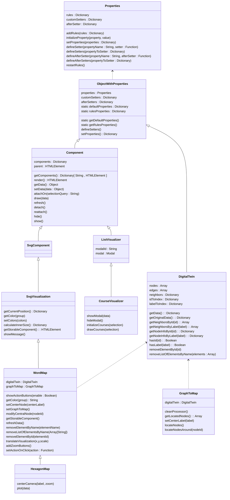

[Framework Documentation](../README.md)

# Class Diagram of the Framework

```mermaid

classDiagram
    class Properties {
        rules : Dictionary
        customSetters : Dictionary
        afterSetter : Dictionary

        addRules(rules : Dictionary)
        initializeProperty(property, value)
        setProperties(properties : Dictionary)
        defineSetter(propertyName : String, setter : Function)
        defineSetters(propertyToSetter : Dictionary)
        defineAfterSetter(propertyName : String, afterSetter : Function)
        defineAfterSetters(propertyToSetter : Dictionary)
        restartRules()
    }

    class ObjectWithProperties {
        properties : Properties
        customSetters : Dictionary
        afterSetters : Dictionary
        static defaultProperties : Dictionary
        static rulesProperties : Dictionary
        
        static getDefaultProperties()
        static getRulesProperties()
        defineSetters()
        setProperties() Dictionary
    }

    class Component {
        components : Dictionary
        parent : HTMLElement

        getComponents() Dictionary[ String , HTMLElement ]
        render() HTMLElement
        getData() Object
        setData(data : Object)
        attachOn(selectionQuery : String)
        draw(data)
        refresh()
        detach()
        reattach()
        hide()
        show()
    }

    class SvgVisualization {
        getCurrentPosition() Dictionary
        getColor(group)
        setColors(colors)
        calculateInnerSize() Dictionary
        getStorableComponent() : HTMLElement
        showMessage()
    }

    class SvgComponent {

    }

    class ListVisualizer {
        modalId : String
        modal : Modal
    }

    class CourseVisualizer {
        showModal(data)
        hideModal()
        initializeCourses(selection)
        drawCourses(selection)
    }

    class WordMap {
        digitalTwin : DigitalTwin
        graphToMap : GraphToMap

        showActionButtons(enable : Boolean)
        getColor(group) String
        setCenterNode(centerLabel)
        setGraphToMap()
        modifyCentralNode(nodeId)
        getStorableComponent()
        refreshData()

        removeElementByName(elementName)
        removeListOfElementsByName(Array[String])
        removeElementById(elementId)

        translateVisualization(x,y,scale)
        addZoomButtons()
        setActionOnClick( action : Function)
    }

    class HexagonMap {
        centerCamera(label, zoom)
        plot(data)
    }

    class DigitalTwin {
        nodes : Array
        edges : Array
        neighbors : Dictionary
        idToIndex : Dictionary
        labelToIndex : Dictionary

        getData() : Dictionary
        getOriginalData() : Dictionary
        getNeighborsById(id) : Array
        getNeighborsByLabel(label) : Array
        getNodeInfoById(id) : Dictionary
        getNodeInfoByLabel(label) : Dictionary
        hasId(id) : Boolean
        hasLabel(label) : Boolean
        removeElementById(id)
        removeListOfElementsByName(elements : Array)
    }

    class GraphToMap {
        digitalTwin : DigitalTwin
        
        cleanProcessor()
        getLocatedNodes() : Array
        setCenterLabel(label)
        locateNodes()
        locateNodesAround(nodeId)
    }

    Properties <.. ObjectWithProperties
    ObjectWithProperties <|-- DigitalTwin
    ObjectWithProperties <|-- Component
    SvgComponent <|-- SvgVisualization
    Component <|-- SvgComponent
    Component <|-- ListVisualizer
    ListVisualizer <|-- CourseVisualizer
    SvgVisualization <|-- WordMap
    WordMap <|-- HexagonMap
    DigitalTwin <.. WordMap
    DigitalTwin <.. GraphToMap

```