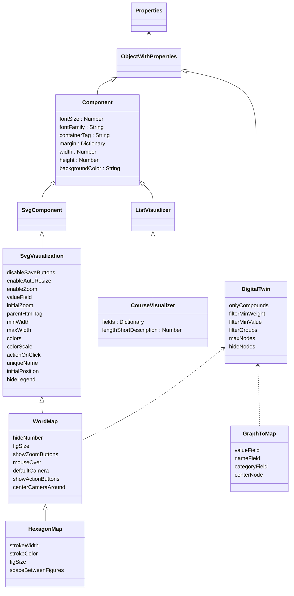

[Framework Documentation](../README.md)

# Diagram of Properties

```mermaid

classDiagram
    class Properties {
        
    }

    class ObjectWithProperties {
        
    }

    class Component {
        fontSize : Number
        fontFamily : String
        containerTag : String
        margin : Dictionary
        width : Number
        height : Number
        backgroundColor : String
    }

    class SvgVisualization {
        disableSaveButtons
        enableAutoResize
        enableZoom
        valueField
        initialZoom
        parentHtmlTag
        minWidth
        maxWidth
        colors
        colorScale
        actionOnClick
        uniqueName
        initialPosition
        hideLegend
    }

    class SvgComponent {

    }

    class ListVisualizer {
        
    }

    class CourseVisualizer {
        fields : Dictionary
        lengthShortDescription : Number
    }

    class WordMap {
        hideNumber
        figSize
        showZoomButtons
        mouseOver
        defaultCamera
        showActionButtons
        centerCameraAround
    }

    class HexagonMap {
        strokeWidth
        strokeColor
        figSize
        spaceBetweenFigures
    }

    class DigitalTwin {
        onlyCompounds
        filterMinWeight
        filterMinValue
        filterGroups
        maxNodes
        hideNodes
    }

    class GraphToMap {
        valueField
        nameField
        categoryField
        centerNode
    }

    Properties <.. ObjectWithProperties
    ObjectWithProperties <|-- DigitalTwin
    ObjectWithProperties <|-- Component
    SvgComponent <|-- SvgVisualization
    Component <|-- SvgComponent
    Component <|-- ListVisualizer
    ListVisualizer <|-- CourseVisualizer
    SvgVisualization <|-- WordMap
    WordMap <|-- HexagonMap
    DigitalTwin <.. WordMap
    DigitalTwin <.. GraphToMap

```