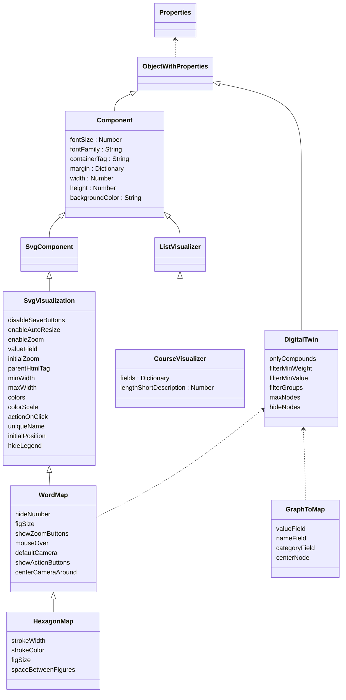

[Framework Documentation](../README.md)

# Diagram of Properties



## Description of each Property

In the following table you can see all the Visual Properties that are considered to be modified or customized during the integration of the DDV in other platforms or systems. The Properties that appear in the diagram but are not listed in the following table should not be modified outside of the development process.

| **Name** | **Type** | **Description** | **Accepted Values or (Default Value)** |
| -- | --- | --- | -- |
| **Visual Properties** |
| fontSize          | Number | Font Size of all the text labels in the visualization.   | Any positive Integer (**14**) |
| fontFamily        | String | FontFamily of all the text labels in the visualization.	| (**"sans-serif"**) |
| width             | Number | Width of the Component. If IFrame mode is enabled, this value will be used to preserve the aspect ratio in bigger or smaller windows. | E.j 800 |
| height            | Number | Height of the Component. If IFrame mode is enabled, this value will be used to preserve the aspect ratio in bigger or smaller windows. | E.j 600 |
| backgroundColor   | String | Hexadecimal color | (**#F9F9F9**) |
| colors                | Array | List of Hexadecimal colors | E.j ["#A0A000,#F000F0"] |
| colorScale            | String | Adjusts intensity of the colors based on its numerical equivalent in the selected scale | sqrt, log, (**linear**), pow, flat |
| **Interaction** |
| disableSaveButtons    | Boolean | If True, Save Buttons dissapear from the UI | (**False**) |
| actionOnClick         | String  | Case insensitive String that defines the action to be performed when a concept in the WordMap is clicked | showDetails, remove, showValues, recenter, highlight, source, showRelations |
| **Screen Configuration** |
| initialZoom           | Number | Defines a custom initial zoom around the central node of the map | (**1.0**) |
| centerCameraAround    | String | Label of the Node that will appear in the center of the Screen when initial rendering occurs | E.j "Data Science" |

**Configuration exclusive for WordMaps (HexagonMap and SquareMap)**

| **Name** | **Type** | **Description** | **Accepted Values or Example Value (Default)** |
| -- | --- | --- | -- |
| hideNumber            | Boolean   |
| figSize               | Number    | Size of the Figures (Hexagons or Squares) in the MindMap. | Any positive integer (70) |
| strokeColor           | String    | Hexadecimal color of the strokes that separate non-related concepts in a WordMap | (**"#000000"**)
| onlyCompounds         | Boolean   | If True, the Map will ONLY show concepts that have more than 1 word | ("**False**") |
| filterMinValue        | Number    |
| maxNodes              | Number    |
| hideNodes             | Array     |
| centerNode            |  | 
| valueFieldToShow      |  |
| showZoomButtons       | Boolean |

## Properties passed via URL

DDV supports to standard formats for the parameter names that are passed via URL: underscore-case and camel-case.

Both examples are valid:

```
# underscore_case

fig_size=10,font_family=Arial,font_size=10
```

```
# camelCase

figSize=10,fontFamily=Arial,fontSize=10
```

There are certain exceptions and slight changes when parameters are passed via URL. This is caused because certain characters are considered as "special" or "reserved" on URLs (& or # for example). The special cases are described below:

* The DDV can receive the URL that points to the JSON that contains the data to be visualized. This JSON URL can be passed in the parameter called * **json_url** *

Example:

```
json_url=
```

* If an Array parameter is passed via URL, you must represent it as a string of elements separated by comma. Spaces between commas are not relevant.

Examples:

```
labels=label 1, label 2, label 3
labels=label 1, label 2, label 3&another_param=another_value
```

* When Colors are passed via URL, you must avoid using the hash symbol (#). This character is processed in URLs to define fragment identifiers.

Examples:

```
colors=A0A000,FA3409
```