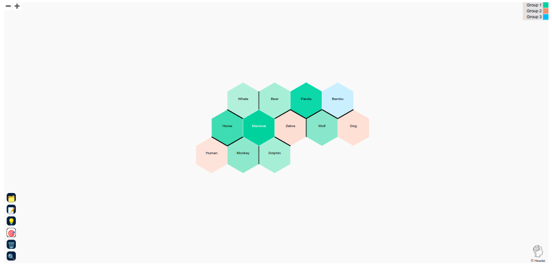
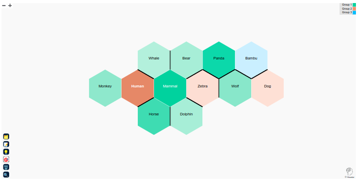
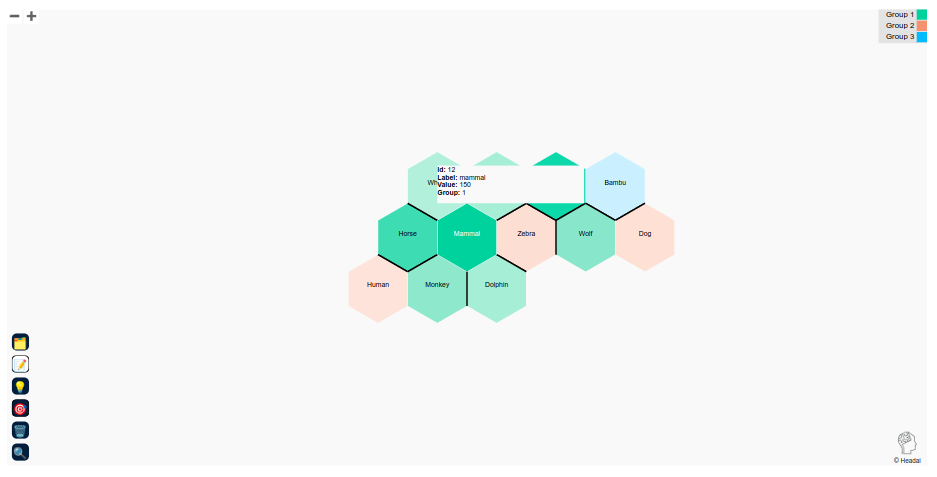
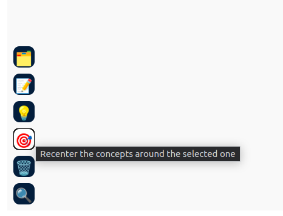
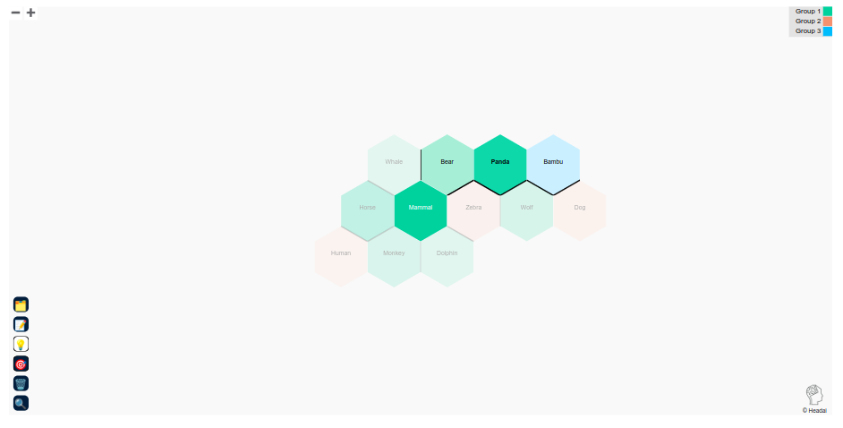
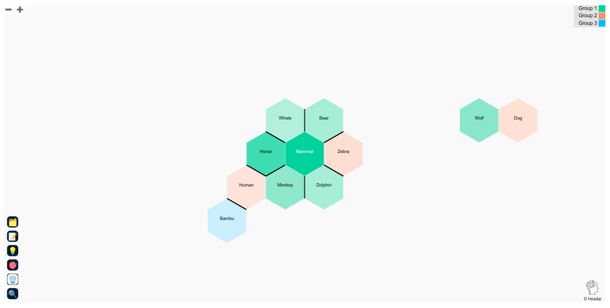
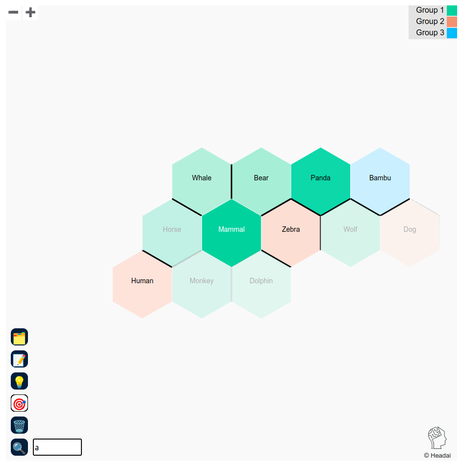

# UI Tests

All the UI Tests are located under the folder [/test](../../test/) in the root directory of the repository.

These files are served in the development environment via Webpack. You can access them by following the instructions of the main [README](../../README.md#running-instructions-with-container). Once Webpack is serving the DDV library, those test files will be accesible at http://localhost:8080/test/.

| Test Case ID | TC001 |
| --- | --- |
| Description | Validate successful visualization rendering from a valid JSON URL. |
| Expected Result | Mammal must be the concept with darkest color, and must be directly connected with Horse, Whale, Bear, Zebra, Dolphin and Monkey, each one located in one of the six sides of the hexagon. These are located next to Mammal because they are the most relevant skills related to Mammal. There must be a black line that separates Horse with Whale, human and monkey. This occurs because in the graph, those terms are not directly connected (there is not an edge that connects those terms with Horse). Although Wolf and Dog are related with Mammal, they are out of the main group because they are only connected with the term Mammal, but the six spaces around it have already been filled by other concepts with greater values. There are three orange concepts (Human, Zebra, Dog) and 1 blue concept (Bambu), the other hexagons must belong to the green category. |
| Actual Outcome |  |
| Status |  |
| Comments |  |

| Test Case ID | TC002 |
| --- | --- |
| Description | Validate recenter action |
| Pre-requisite | Make sure that the recenter action, represented by the button with the bullseye icon (🎯) is active. By default it should be active. |
| Expected Action | Click on the Hexagon that represents the keyword "Human" |
| Expected Result | The concepts present in the Hexagon Map should reorganize around the "Human" concept. The background of the "Human" hexagon should blink, oscilating between black, orange and white. The only two concepts that should have a direct connection with Human are "Monkey" and "Mammal". There must be a black division that separates "Human" from "Whale" and "Horse". |
| Actual Outcome |  |
| Status |  |
| Comments |  |

| Test Case ID | TC003 |
| --- | --- |
| Description | Validate group selection |
| Expected Action | Click on the button for group selection, which is represented by the button with the folder (🗂️). After that, you must click in the legend section, removing the |
| Expected Result | The concepts present in the Hexagon Map should reorganize around the "Human" concept. The background of the "Human" hexagon should blink, oscilating between black, orange and white. The only two concepts that should have a direct connection with Human are "Monkey" and "Mammal". There must be a black division that separates "Human" from "Whale" and "Horse". |
| Actual Outcome |  |
| Status | THIS FUNCTIONALITY REQUIRES A FIX IN THE NEXT RELEASE. |
| Comments |  |

| Test Case ID | TC004 |
| --- | --- |
| Description | Validate the action that displays details about the nodes. |
| Pre-requisite | Make sure that the action represented by the button with the memo icon (📝) is active.|
| Expected Action | Click on the hexagon of "Mammal" concept. |
| Expected Result | There should be visible a tooltip that displays: id=12,label=mammal, value=150, group=1. To hide the tooltip you must put your mouse over it and then out of it. |
| Actual Outcome |  |
| Status |  |
| Comments |  |

| Test Case ID | TC005 |
| --- | --- |
| Description | Validate text on hover. |
| Expected Action | Put your mouse without clicking over each of the buttons present in the bottom left-hand corner. |
| Expected Result | A short text should be displayed on hover, describing each action. |
| Actual Outcome |  |
| Status |  |
| Comments |  |

| Test Case ID | TC006 |
| --- | --- |
| Description | Validate highlight action. |
| Pre-requisite | Make sure that the action represented by the light bulb icon (💡) is active.|
| Expected Action | Click on the hexagon of "Panda" concept |
| Expected Result | The only 4 concepts that should remain active are Mammal, Bear, Panda and Bambu. The rest of hexagons should have reduced their color intensity. This action blurs the concepts that are not directly connected with the clicked concept. |
| Actual Outcome |  |
| Status |  |
| Comments |  |

| Test Case ID | TC007 |
| --- | --- |
| Description | Validate remove action. |
| Pre-requisite | Make sure that the action represented by the wastebasket icon (🗑️) is active.|
| Expected Action | Click on the hexagon of "Panda" concept |
| Expected Result | The concept of "Panda" should not be visible anymore. Given that bambu concept is not related with the other concepts, it should be repositioned, and, if it's next to another hexagon, there must be a black division to separate them.|
| Actual Outcome |  |
| Status |  |
| Comments |  |

| Test Case ID | TC008 |
| --- | --- |
| Description | Validate search action. |
| Expected Action | Click on the icon that has a magnifying glass on it (🔍). This will display a textbox next to the button. After that, click inside the textbox, type "a" and press enter.  |
| Expected Result | The visualization should highlight all the hexagons of the concepts that contains "a" in their labels. Concepts like Horse, Monkey or Dolphin should have reduced their intensity in the visual. |
| Actual Outcome |  |
| Status |  |
| Comments |  |

| Test Case ID | TC009 |
| --- | --- |
| Description | Exit the search mode |
| Pre-requisite | Search action must be activated. Follow the instructions of TC008. |
| Expected Action | You can exit the search mode by clicking on the textbox and pressing the key "Esc" in your keyboard. An alternative way is by clicking again the button that has the magnifying glass (🔍). |
| Expected Result | The visualization should return to the initial state before following the instructions of TC008. |
| Actual Outcome |  |
| Status |  |
| Comments |  |

