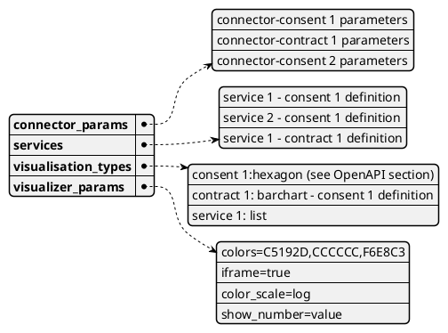
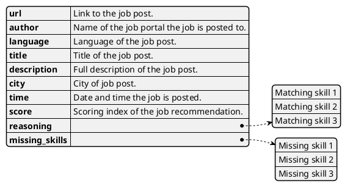
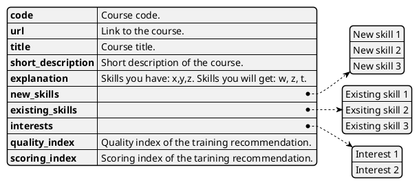
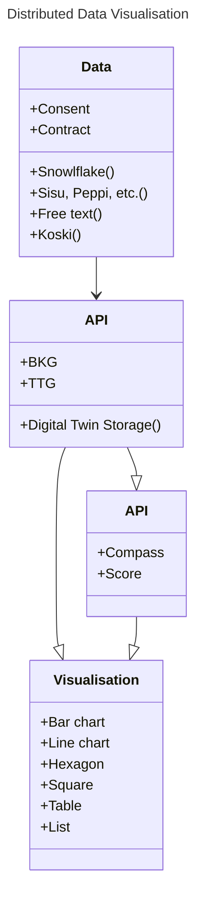
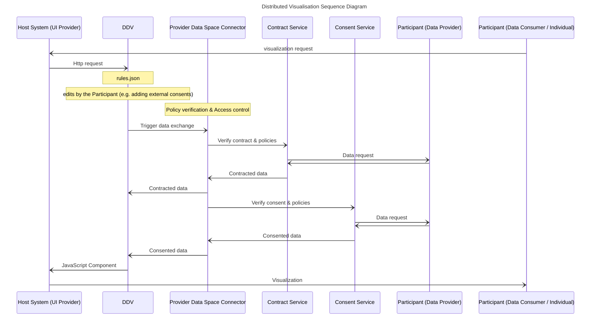

# Distributed Data Visualization Design Document

Distributed Data Visualisation is an on-device building block to ease up building end-user UIs for showing data in an informative way. It allows AI providers to display the results of their analytics, predictions and recommendations.

The building block is a reusable, portable and multi-platform supported HTML5 / JavaSript & D3.js based component that can be displayed by UI provider from any source.

This concept is not only about presenting data in an accessible format, but also about revolutionizing the way data interacts across different platforms, ensuring data privacy and improving user control. With the Prometheus-X project at the forefront, a ground-breaking approach to handling education and career development data will redefine industry standards.

Distributed data visualization is a sophisticated framework designed to seamlessly manage and display data across multiple platforms. It enables AI providers to process datasets from different data providers and gain valuable insights such as recommendations, analysis and predictions. What makes this approach special is the ability to easily integrate these results into different applications and user interfaces (UI), making it a versatile tool for educational and professional development.

## Technical usage scenarios & Features

Distributed data visualisation builds the story /user journey for the given goal and given data sets, it applies other building blocks to modify/anonymize/analyse the data. It enables to run analysis by applying other building blocks and Data Space Services from Catalog (under contract). 

### Features/main functionalities

_In-depth description of BB features (details).
Again, an enumeration (ie bullet points) is useful. Take input from description for WP2_

**User journey case 1:**

Use case description, value and goal:
Use information from Korean users' Diploma and Transcript to match job opportunities in the EU (France). Skills data extracted from the documents will be used for service providers in the EU to recommend potential employment opportunities. 
The use case will take as basis Pino a product from Solideos used by Korean citizens to store their diploma and learning credentials.

Use case functionalities:
- As a Korean professional, I can digitally share my credentials, streamlining my job applications, and improving my employment prospects
- As a Job Matching service, I can match regional jobs to an international pool of qualified applicants
- As a EU company, I can quickly verify Korean applicants’ educational credentials for efficient hiring

**User journey case 2:**

Use case description, value and goal:
LAB aims to prepare individuals for the job market by offering personalized training recommendations worldwide, leveraging skills data and partnerships with service providers like Headai, Inokufu, Rejustify, and Edunao. The goal is to equip learners with relevant skills for career success, enhancing employability and lifelong learning.

Use case functionalities:
- Personalized training recommendations based on skills data analysis.
- Access to high-quality training opportunities worldwide.
- Skills forecasting and analytics for anticipating future skill demands.
- Skills assessment and analysis to determine individual skills and areas for improvement.

**Generic user journey:**

1. Matilda has data about herself in several LMS/LXP
2. She's using a new learning provider and wants to receive personalised learning recommendations based on any/all her data
3. She can share her data from service provider to another and the results are displayed inside one of those
4. Service provider only has to integrate the data viz BB and PTX Connector into LMS/LXP

### Technical usage scenarios

Distributed Data Visualisation is a on-device building block meant to ease up building end-user UIs for showing data in informative way with a relevant story/journey. Visualiser requires a host system that runs the UI and that host system must configure it's components (consent, contract) that are needed to operate this building block.

Because of the nature of this building block being slightly different than others, the reader of this document can not assume all server-side-building-blocks behaviors to exist in this BB.

**Technical usage scenario 1:**

User would gives her/his consent, it triggers "API consumption" by sending the data as a payload to this API call to the AI, and the data will be returned by the protocol. In this flow, the connector of the edtech side would send the result of the AI service back to the edtech so that it could be shown to the user.

**Technical usage scenario 2:**

User gives her/his consent to datasets, data provider(s) gives contracts to datasets that are not personal data. All consents/contracts are sent to Visualiser with additional metadata (data endpoint definitions). Visualizer fetches all the data based on this data. The Case 2 would ease up the Visualiser configuration.

Tech usage scenario in short
- Host system that runs UI calls the BB07 with 'rules.json' that contains
    - connector params
    - services in use
    - visualisation types
- Host system loads the Visualiser
- Consent and data retrieved
- All Data fetched
- Journey and visualisations related to journey determined
- Recommendations loaded
- Journey visualized

With Distributed data visualisation, Data providers and Data consumers can easily bring their services to end users without developing all the middleware components on their own. 

For exapmle, a LMS company using Moodle, can integrate the Distributed data visualisation directly to Moodle and so focus on their LMS provider role, while this building block do all the Data Space technical operations.

## Requirements

**Functional requirements:**

- All datasets must be ready before launching the visualizer
- Individuals must consent to the use of their data
- Organization must sign a contract to transfer the data
- Distributed data visualizer is not responsible of the data, data quality and data validity. Other building blocks ensure data veracity.
- Building block visualizes the given data without manipulations or modifications.
- rules.json must contain all the necessary information (consents, contracts, needed services) in order for building block to be able to perform its task
- Further development:
    - BB07 must be able to include new data models by simple conversion table / mapping
    - BB07 must be able to include new visualisation scripts

**Performance requirements:**

- Response time for a big visualization; 60 seconds
- Response time for an average individual skills profile visualization; less than 1 second

**Security requirements:**

- DDV is not allowed to send or share data without specific consent and specific service decribed in rules.json
- DDV is not allowed to use software libraries that may share the data
- DDV is not allowed to store the data or collect logs about data or user identity

**Dependability requirements:**

In case of incomplete rules.json or data the DDV closes the process and returns error message.

**Operational requirements:**

- DDV requires minimum memory and minimum CPU time, which will be defined later.
- Host system must support JavaScript.

## Integrations

### Direct Integrations with Other BBs

There is no direct integrations with other BBs except Connector. All the following integrations are optional.

### Integrations via Connector

- Edge translators (BB03)
    - Translate ontologies in-between visualisation steps if needed
- Consent/Contracts negotation agent (BB05)
    - Permits to use personal data
    - Permits to use nonpersonal data
- Data value chain tracker (BB06)
    - Track business value
    - Trace direct and indirect data usage
- Data veracity assurance (BB08)
    - Evaluate data quality characteristics
    - Ensure that data is consistent
- Distributed learning analytics management services (BB09)
    - One possible data provider for DDV

## Relevant Standards

The standard data formats are applied in a way that the Building Block specific data model is convertible to any other model with standard tools. This could mean e.g. that 1) graph-data in JSON-LD format can be converted to a CSV table, where nodes and their values are only used. So this node-csv can be used directly in excel for drawing barcharts. 2) JSON-LD can be mapped in PowerBi and applied in any PowerBi report as such. The fundamental idea is to bring a universal skills data visualization building block and at the same time support any data visualization tool.

### Data Format Standards

- Standard data visualization models like tables and graphs
- Open source frameworks, like D3.js and Chartist.js (standard way to use) 
- Data storing technologies, like browser-cookies (industry standard) and data-api:s (standard way to use) 
- HTML5
- JavaSript 
- JSON

### Mapping to Data Space Reference Architecture Models (TODO)

_Mapping to [DSSC](https://dssc.eu/space/DDP/117211137/DSSC+Delivery+Plan+-+Summary+of+assets+publication) or [IDS RAM](https://docs.internationaldataspaces.org/ids-knowledgebase/v/ids-ram-4/)_

## Input / Output Data

**Input data format:**

Host system sends the building block the following information in rules.json:

**Output data format:**

Depending on the rules.json, the BB appplies the appropriate endpoints to retrieve training or job recommendations. In addition to displaying recommendations, it can also display analytics or metadata of different datasets.

**Use case 1 (Job recommendations)**

BB displays the following json in an interactive and user friendly frame, through the JavaScript web component:

Above example is of one recommendation. Component displays several recommendations of such, depending on the configurations set by the host system or end user.

**Use case 2 (Training recommendations)**

BB displays the following json in an interactive and user friendly frame, through the JavaScript web component:

## Architecture

## Dynamic Behaviour

The sequence diagram shows how the component communicates with other components.

## Configuration and deployment settings

_What configuration options does this BB have?
What is the configuration format?
Provide examples.
How is the component logging the operations? What are the error scenarios? What are the limits in terms of usage (e.g. number of requests, size of dataset, etc.)?_

Configuration of the BB07 can be done in two places 
- rules.json (see section Input / Output Data)
- parameters given in visualizer HTTP-GET (see section OpenAPI Specifications)

The given parameters follows REST-API type of GET parameters, so only values that could be publicly seen or strongly encrypted values are allowed.

## Third Party Components & Licenses

Background Component: D3.js
Available at D3.js Git  https://github.com/d3/d3    

D3.js is licensed under the ISC License.
https://github.com/d3/d3/blob/main/LICENSE  

In order to maximise cyber security we have isolated d3.js online-dependencies in current development version, which may cause small differences on how code behaviors when developed further. This decison may change during the development.

## OpenAPI Specification (TODO)

Headai Visualizer

### Functionalities

- Customize Visual Style of Visualizations
- Strong Validation of URL Parameters (data type verification, default values for parameters, warning messages in the screen)
- Full-Screen Mode to enable external embeddings in IFrames, this mode will hide buttons and sidebar columns. It also activates Responsive Mode (minWidth and maxWidth)
- Store Visualization as PNG or SVG
- Clean MindMaps, store modified data in Megatron, and get generated URL
- Receive custom parameters via URL

### Full URL Example, development version

- https://megatron.headai.com/HeadaiVisualizer.html?&color_scale=log&word_type=&hide_nodes=&json_url=https://megatron.headai.com/analysis/BuildSignals/BuildSignals_xwiaHk1n3p1672366166478.json&word_type=only_compounds

Data behind encrypted contract 'xwiaHk1n3p1672366166478'

### URL Parameters

| **Name** | **Description** | **Accepted Values or Example Value (Default)** |
| --- | --- | --- |
| Fundamental Parameters |     |     |
| json_url  (**mandatory**) | URL with the JSON Data. If mode=customize or mode=clean, this parameter can be empty. | **Example:** <https://test.headai.com/a.json> |
| plot_type | Type of Visualization to show from the given URL.  If **Empty**, the Visualizer will try to detect automatically the structure of the JSON. | top20 , linechart,  horizontalbarchart, verticalbarchart,  hexagon , square, barchart |
| --- | --- | --- |
| mode | **Customize:** Shows a Form to fill all the editable parameters (plus export mode)  **Clean:** Enables interaction to remove clicked concepts. Shows buttons to store modified data, and to get generated URL in the clipboard. **Export:** Shows Buttons to store the visualization as SVG, PNG, or JSON. **NOTE:** This parameter is ignored If iframe mode is enabled | customize  clean  export  **&lt;empty&gt;** |
| Visual Customization |     |     |
| iframe | Enable or Disable Full-Screen Mode for IFrame Embedding. If mode=customize, the value of this parameter is ignored. | true, **false** |
| width | Width of the Component. If IFrame mode is enabled, this value will be used to preserve the aspect ratio in bigger or smaller windows. | Any positive integer **(1400)** |
| height | Height of the Component. If IFrame mode is enabled, this value will be used to preserve the aspect ratio in bigger or smaller windows. | Any positive integer **(800)** |
| font_family | FontFamily of all the text labels in the visualization. | serif , **sans-serif** , cursive , monospace |
| font_size | Font Size of all the text labels in the visualization. | Any positive integer **(14)** |
| hide_legend | Boolean that enables hiding the legend of certain visualization. | true, **false** |
| background_color | Hexadecimal color | **(#F9F9F9)** |
| Parameters under Development |     |     |
| legends | List of comma-separated strings with the customized legends | “Demand, Offer, Intersection” |

### URL Parameters when plot_type is hexagon or square
<table><thead><tr><td>Name</td><td>Description</td><td>Accepted Values or Example Value (Default)</td></tr><tr><td colspan="3">Visual Customization</td></tr><tr><td>fig_size</td><td>Size of the Figures in the MindMap. This is equivalent to HexagonRadius or SquareSize in wordplot library.</td><td>Any positive integer (70)</td></tr><tr><td>center_node</td><td>Label of the concept that will be in the center. This means that all the concepts will be reorganized around the specified term. If empty, the central concept will be the one with the largest value.</td><td>Example: artificial intelligenceartificial_intelligence (space or underscore work)</td></tr><tr><td>center_camera_around</td><td>Centers the initial position of the visualization focusing on a specific concept (this only affects the position of the camera, not the content of the map). If empty, the camera will focus on the center_node. This parameter won’t work if you don’t specify a valid value for initial_zoom.</td><td>Example: climate_change</td></tr><tr><td>initial_zoom</td><td>Defines the initial zoom of the camera. If empty, the camera will try to show all the concepts of the visualization on the screen, automatically calculating the optimal position. If this parameter is empty or incorrect, center_camera_around will be ignored.</td><td>Example: 0.8</td></tr><tr><td>click_action</td><td>remove: Deletes clicked conceptsshowValues: Shows historical data as line chart (only for signals maps)showDetails: Shows the attributes of the clickedhighlight: shows the neighborhood of the clicked conceptsource: Shows the list of sources if info is availablerecenter: Reorganizes the map around the clicked concept</td><td>Values (Case Insensitive):remove (default when mode=clean)showValues (for signals)showDetailshighlightsourcerecenter</td></tr><tr><td>colors</td><td>Hexadecimal code of the colors, separated by a comma and without the numeral character '#'.</td><td>Example: "A0A000,F000F0"</td></tr><tr><td>color_scale</td><td></td><td>sqrt , log , linear , pow , flat</td></tr><tr><td>stroke_color</td><td></td><td></td></tr><tr><td>show_number</td><td>Defines which numerical value of the nodes will be displayed inside the hexagon along with the label of the concepts.</td><td>Example: value, normalized_value, id, weight, group</td></tr><tr><td>show_action_buttons</td><td></td><td>true, false</td></tr><tr><td colspan="3">Special Modes</td></tr><tr><td>sdg_map</td><td>Json must have a specific format, containing scores and indicators</td><td>true, false</td></tr><tr><td>relevancy_mode</td><td>Boolean that defines if the visualization will display the 5 weights (how meaningful is each concept).This mode shows the 5 different weights with different colors and enables the Legend for them.</td><td>true, false</td></tr><tr><td>only_nearest_neighbours</td><td>This mode places nodes in a way that a hexagon is next to another ONLY if it’s related. This generates a map without any strokes.</td><td>true, false</td></tr><tr><td colspan="3">Data Manipulation</td></tr><tr><td>max_nodes</td><td>Desired number of nodes for the map reduction. The internal algorithm will pick the set of values for MinWeight and MinValue that reduces the map as close to that number as possible. This feature only works if nodes have weights, otherwise it will be ignored.</td><td></td></tr><tr><td>filter_min_weight</td><td></td><td>1,2,3,4,5</td></tr><tr><td>filter_min_value</td><td></td><td>Any positive integer</td></tr><tr><td>word_type</td><td></td><td>only_compounds, &lt;empty&gt;</td></tr><tr><td>hide_nodes</td><td>List of labels separated by comma. These labels represent the nodes you want to hide from the MindMap in the visualization.For compound words you can use underscores or spaces</td><td>Ej:<ul><li>data_science, data_analytics</li><li>data science , data analytics</li></ul></td></tr></thead></table>

Click to view latest version -> [Visualiser Document](https://docs.google.com/document/d/1D2J4LmzRFRGb52NkJqp4uFK8soHuRQRq12vHUeYhlps/edit#heading=h.omblmp6i4rwg)

## Test specification (Marko)

_Test definitions and testing environment should be availaible, and the tests should be repeatable._

### Test plan (Marko)
Testing strategy, tools and methods chosen, methods for acceptance criteria.
To be detailed.

### Unit tests (Marko)

_Here specify the test cases for the components inside the BB.  
Candidates for tools that can be used to implement the test cases: JUnit, Mockito, Pytest._

### Integration tests (Marko)

_Here specify how to test the integration of the components inside the BB.  
Candidates for tools that can be used to implement the test cases: K6, Postman, stepci, Pact  
An example tutorial is available [here](https://github.com/ftsrg-edu/swsv-labs/wiki/2b-Integration-testing)._

### UI test (Marko)

_Candidates for tools that can be used to implement the test cases: Selenium_